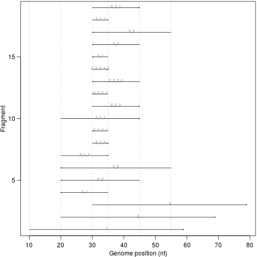

# ampCountR

[](https://travis-ci.org/sherrillmix/ampCountR)
[](https://codecov.io/github/sherrillmix/ampCountR?branch=master)


Some R functions to count the expected amplifications for genomic regions given a set of primer binding locations for a [multiple displacement amplification](http://en.wikipedia.org/wiki/Multiple_displacement_amplification) reaction. To install directly from github, use the [<code>devtools</code>](https://github.com/hadley/devtools) library and run:

```r
devtools::install_github('sherrillmix/ampcountr')
```

The package assumes that forward primer binding sites (primers matching the genomic plus strand) are represented by their leftmost (5'-most in the genomic plus strand) base position and reverse primer binding sites (primers matching the genomic minus strand) are represented by their rightmost (3'-most in the genomic plus strand) base position.

## Functions


```r
library(ampcountr)
```

### countAmplifications
<code>countAmplifications(x,y)</code> to count the number of amplifications predicted for a region with <code>x</code> upstream and <code>y</code> downstream primers (within range and correctly oriented). For example:


```r
countAmplifications(10, 20)
```

```
## [1] 20030009
```

### enumerateAmplifications
<code>enumerateAmplifications()</code> to list the expected amplification products. For example:
    

```r
forwards <- c(1, 11, 21)
reverses <- c(25, 35, 45)
enumerateAmplifications(forwards, reverses, maxLength = 50)
```

```
##    start end strand      name previousLength length
## 1      1  50      +         1              0     50
## 2     11  60      +         2              0     50
## 3     21  70      +         3              0     50
## 4     11  25      -       2_1             15     15
## 5     11  35      -       2_2             25     25
## 6     11  45      -       2_3             35     35
## 7     11  25      +     2_1_1             30     15
## 8     21  25      +     2_1_2             20      5
## 9     21  25      -   2_1_2_1             25      5
## 10    11  35      +     2_2_1             50     25
## 11    21  35      +     2_2_2             40     15
## 12    21  25      -   2_2_2_1             45      5
## 13    21  35      -   2_2_2_2             55     15
## 14    21  25      + 2_2_2_1_1             50      5
## 15    21  25      -       3_1              5      5
## 16    21  35      -       3_2             15     15
## 17    21  45      -       3_3             25     25
## 18    21  25      +     3_1_1             10      5
## 19    21  35      +     3_2_1             30     15
```
    
A simple example of generating predicted fragments for 3 forward primers and 3 reverse primers is:
    

```r
forwards <- c(10, 20, 30)
reverses <- c(35, 45, 55)
frags <- enumerateAmplifications(forwards, reverses, maxLength = 50)
par(mar = c(2.9, 2.8, 0.2, 0.2), mgp = c(1.9, 0.75, 0), las = 1)
plotFrags(frags)
abline(v = forwards, lty = 2, col = "#FF000033")
abline(v = reverses, lty = 2, col = "#0000FF33")
```

 
    
This function is bit slow since it uses recursion without dynamic programming but <code>countAmplifications()</code> should easily handle any large sets.

### predictAmplifications
<code>predictAmplifications()</code> to list the expected amplification products over a genome given primer binding sites on the forward and reverse strand. For example:


```r
forwards <- c(1, 11, 21)
reverses <- c(25, 35, 45)
predictAmplifications(forwards, reverses, maxLength = 50)
```

```
##    start end amplifications
## 4      1  10              6
## 5     11  20             18
## 6     21  25             38
## 7     26  35             18
## 8     36  45              6
## 9     46  50              3
## 10    51  60              2
## 11    61  70              1
```


## Example


A longer example (also accessible from <code>example(ampcountr)</code>:
```R
library(ampcountr)
forwards<-ampcountr:::generateRandomPrimers(100000,1000)
reverses<-ampcountr:::generateRandomPrimers(100000,1000)
amps<-predictAmplifications(forwards,reverses,maxLength=10000)
par(mar=c(3.5,3.5,.2,.2))
plot(1,1,type='n',xlim=c(1,100000),ylim=c(1,max(amps)),
     xlab='Position',ylab='Amplifications',log='y')
segments(amps$start,amps$amplification,amps$end,amps$amplification)
segments(amps$end[-nrow(amps)],amps$amplification[-nrow(amps)],amps$start[-1],amps$amplification[-1])
abline(v=forwards,col='#FF000044',lty=2)
abline(v=reverses,col='#0000FF44',lty=2)
```
This generates an example predicted fold enrichments of:

See [generatePlots.R](generatePlots.R) for complete plotting details.

