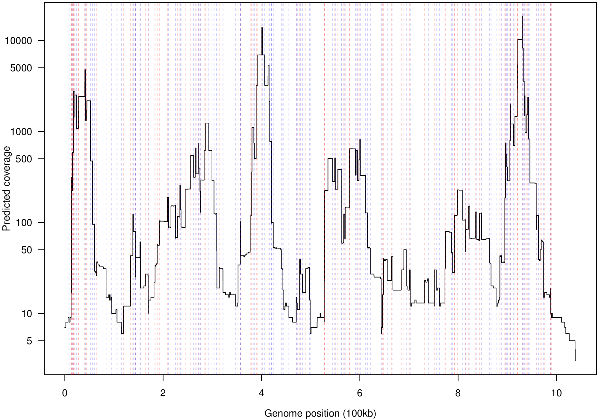

# ampCounter
Some R functions to count the expected amplifications for genomic regions given a set of primer binding locations for a multiple displacement amplification reaction. The main function is <code>countAmplifications()</code> which can be used like:
```
countAmplifications(forwardPrimerLocations,reversePrimerLocations,vocal=TRUE)
```
A more detailed example is given in example.R:
```R
source('ampCounter.R')

forwards<-generateRandomPrimers(1e6,10000)
#+.5 to make sure we don't get any overlaps with forwards
reverses<-generateRandomPrimers(1e6,10000)+.5

frags<-countAmplifications(forwards,reverses,vocal=TRUE)
revFrags<-countAmplifications(forwards,reverses,vocal=TRUE,strand='-')

#+2 for original + and - strand
cover<-countCover(c(frags$start,revFrags$start),c(frags$end,revFrags$end),vocal=TRUE)+2
```
To generate an example predicted fold enrichments of:


The code does not currently try to account for the start and end of primer binding sites and just treats each primer as a single location. This would be an easy extension. Because of this, it is necessary to guarantee that no forward and reverse locations share the same location (e.g. by throwing out duplicates or adding a small amount, say .5, to the reverse primers).
