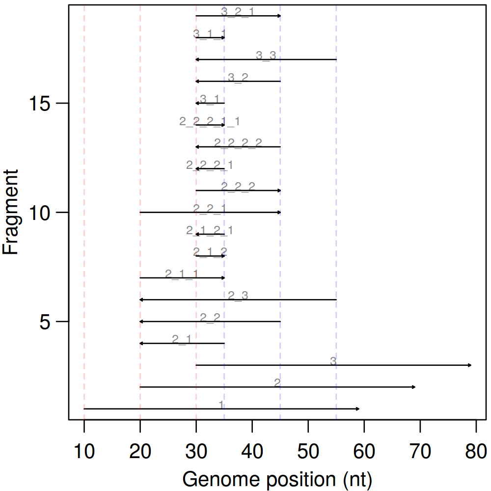
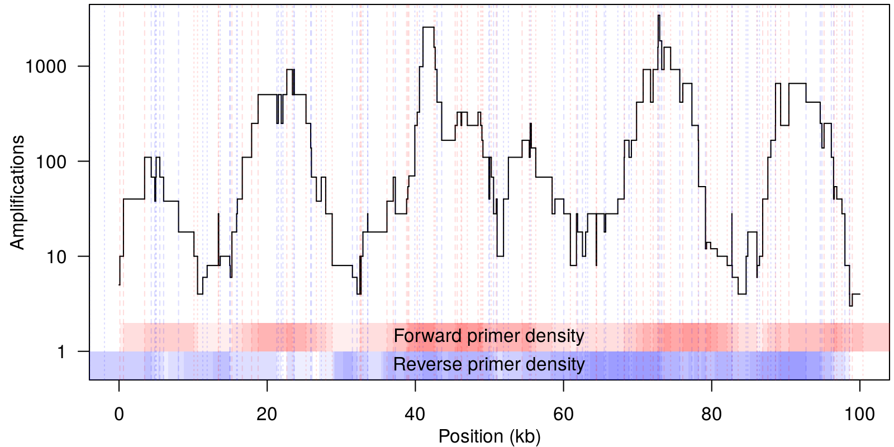

# ampCounter
Some R functions to count the expected amplifications for genomic regions given a set of primer binding locations for a [multiple displacement amplification](http://en.wikipedia.org/wiki/Multiple_displacement_amplification) reaction. To install directly from github, use the [<code>devtools</code>](https://github.com/hadley/devtools) library and run:
```
devtools::install_github('sherrillmix/ampCounter')
```

The main functions are:
* <code>countAmplifications()</code> which can be used like:
        countAmplifications(10,20)
    to count the number of amplifications predicted for a region with 10 upstream and 20 downstream primers (all within range and correctly oriented).

To see the expected amplification products you can use <code>enumerateAmplifications()</code> which can be used like:
```
enumerateAmplifications(forwardPrimerLocations,reversePrimerLocations,vocal=TRUE)
```
A simple example of 3 forward primers and 3 reverse primers is:
```
forwards<-c(10,20,30)
reverses<-c(50,60,70)
frags<-enumerateAmplifications(forwards,reverses,expectedLength=120)
```
This generates predicted fragments of:


This function is slower than it needs to be since it uses recursion without dynamic programming.

A more detailed example is given in example.R:
```R
source('ampCounter.R')

forwards<-generateRandomPrimers(1e6,10000)
#+.5 to make sure we don't get any overlaps with forwards
reverses<-generateRandomPrimers(1e6,10000)+.5

frags<-enumerateAmplifications(forwards,reverses,vocal=TRUE)
revFrags<-enumerateAmplifications(forwards,reverses,vocal=TRUE,strand='-')

#+2 for original + and - strand
cover<-countCover(c(frags$start,revFrags$start),c(frags$end,revFrags$end),vocal=TRUE)+2
```
This generates an example predicted fold enrichments of:


The code does not currently try to account for the start and end of primer binding sites and just treats each primer as a single location. This would be an easy extension. Because of this, it is necessary to guarantee that no forward and reverse locations share the same location (e.g. by throwing out duplicates or adding a small amount, say .5, to the reverse primers).
